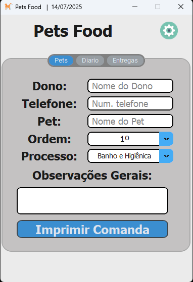
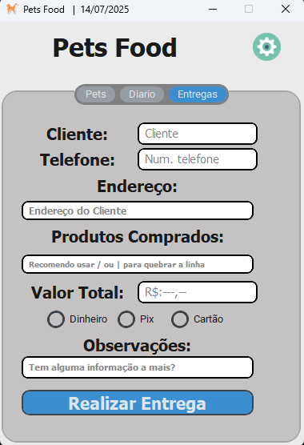
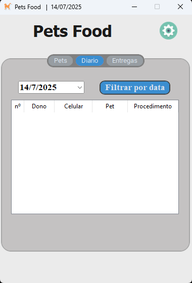
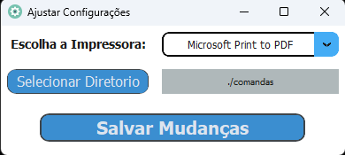

# Gestor Pets Food

Este projeto é uma ferramenta para pet shops que facilita a emissão de comandas, permitindo o acesso rápido às informações e auxiliando na impressão de comandas de entregas.

## Tecnologias Usadas

* Python 3.11
* Custom Tkinter
* SQLite
* Pyinstaller (**opicional**)

## Instalação e Utilização

**1.** Clone Nosso Repositorio em sua maquina local

 ```bash
git clone https://github.com/Ewerton082/Gestor-pet-2025.git
```

**2.** Crie e ative seu ambiente virtual

* __Criando Venv:__
`python -m venv venv`

* __Ativando Venv:__
`venv\Scripts\activate`

* __Instalando depêndencias:__
`pip install -r requeriments.txt`


Abra o projeto usando o **Main.py**. Ao abrir pela primeira vez clique no botão de imprimir para setar as pastas do banco de dados e criar o arquivo de impressão, após isso configure a impressora a ser usada e local onde está o arquivo de impressão.

Após isso Feche o app e abra mais uma vez e estará pronto para uso.

## Caso Queira apenas o executavel deixarei na pasta **readyToUse**

Crie uma pasta na sua maquina no local desejado e apenas copie tudo que tiver dentro da **readyToUse** e pronto ja está funcionando

### Imagens








